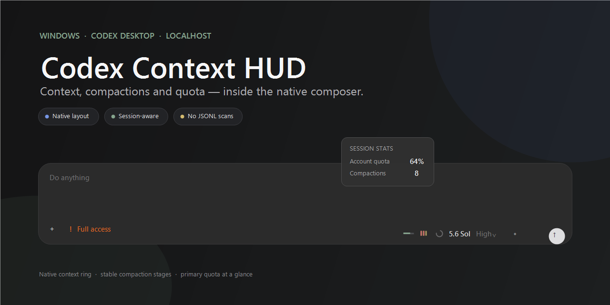
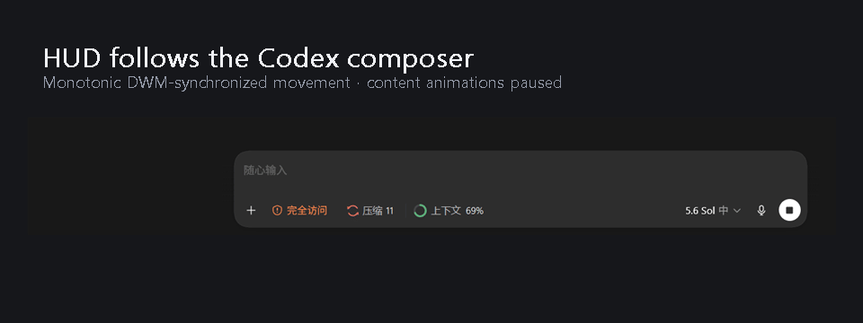
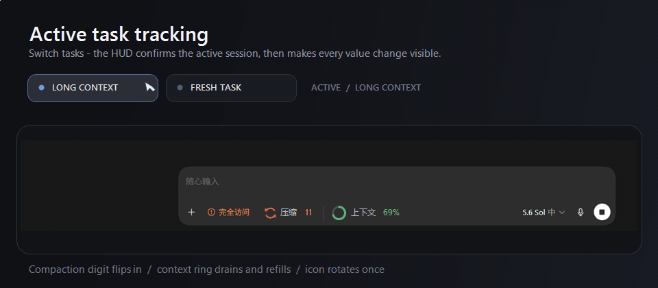

# Codex Context HUD

English · [简体中文](README.md)

<p align="center">
  
</p>

<p align="center">
  <a href="https://github.com/wtf12345789/codex-context-hud/actions/workflows/build.yml"></a>
  <a href="https://github.com/wtf12345789/codex-context-hud/releases"></a>
  
  
  <a href="LICENSE"></a>
</p>

A read-only, local, injection-free HUD for Codex Desktop on Windows. It stays near the composer and shows the active task's context usage and compaction count while following task and sidebar changes.

> Unofficial project. It does not modify Codex installation files and does not require Codex++, DevTools, CDP, Node.js, Rust, or a model API.

## Demo

### Sidebar tracking

<p align="center">
  
</p>

Only spatial position changes during sidebar motion. Digits, rings, icons, and color transitions pause until movement completes.

### Task switching

<p align="center">
  
</p>

After the active task is confirmed, the new compaction count flips in, the context ring drains and refills, and the compaction icon rotates once so the task change is unmistakable.

## Highlights

- Tracks the active Codex task automatically.
- Shows context usage and the number of compactions.
- Native-looking, borderless, click-through rendering beside the composer.
- DWM-synchronized sidebar motion with content animations paused during movement.
- Reads local structured runtime/session signals only; no network access and no conversation text storage.
- Per-user installer, startup shortcut, uninstaller, and portable release package.

## Install

Requirements: Windows 10/11 and Codex Desktop.

1. Download `CodexContextHUD-portable.zip` from [Releases](https://github.com/wtf12345789/codex-context-hud/releases).
2. Extract it and open PowerShell in the extracted directory.
3. Run:

```powershell
powershell -ExecutionPolicy Bypass -File .\Install.ps1
```

The default install location is `%LOCALAPPDATA%\CodexContextHUD`. The installer never closes, terminates, or restarts Codex.

Use `-NoStartup` to skip the login startup shortcut or `-NoLaunch` to avoid launching the HUD after installation.

## Uninstall

Run from the extracted release directory:

```powershell
powershell -ExecutionPolicy Bypass -File .\Uninstall.ps1
```

Only the HUD process, its installed files, and its own startup shortcut are removed. Codex is not touched.

## Privacy and security boundary

- Uses `$CODEX_HOME\sessions`, falling back to `%USERPROFILE%\.codex\sessions`.
- Incrementally parses only structured fields needed for task identity, token usage, and compaction events.
- Uses Windows UI Automation only for control geometry and sidebar state.
- Does not upload logs, prompts, conversation text, cookies, tokens, credentials, or account data.
- Never attach raw Codex JSONL/session logs or private task screenshots to a public issue.

## Build from source

```powershell
.\Build.ps1
```

The build uses the .NET Framework compiler included with Windows, downloads no dependencies, and runs a minimal self-test.

Build the same portable archive structure used by GitHub Releases:

```powershell
.\Package.ps1
```

This rebuilds the executable, regenerates `SHA256SUMS.txt`, and writes `CodexContextHUD-portable.zip`.

## Limitations

- Windows Codex Desktop only.
- This is not an official plugin API. Major changes to Codex's UI Automation tree, runtime logs, or local session format may require compatibility updates.
- Context usage is the value reported by Codex runtime data, not an independently re-tokenized estimate.

## Related projects

| Project | Form | Platform | Active-task context | Compaction count | No renderer injection |
| --- | --- | --- | ---: | ---: | ---: |
| **Codex Context HUD** | Standalone composer HUD | Windows | ✅ | ✅ | ✅ |
| [codex-context-used-meter](https://github.com/Minghou-Lei/codex-context-used-meter) | Codex++ user script | Windows / macOS | ✅ | — | — |
| [CodexBar](https://github.com/steipete/CodexBar) | Menu bar usage center | macOS | Account-focused | — | ✅ |

`codex-context-used-meter` is the closest match and adds provider balances and history charts. This project deliberately takes a narrower standalone Windows HUD approach, requires no Codex++/renderer injection, and also surfaces compaction count. See [openai/codex#23794](https://github.com/openai/codex/issues/23794) for community demand around a persistent Codex Desktop context indicator.

## License

[MIT](LICENSE)
