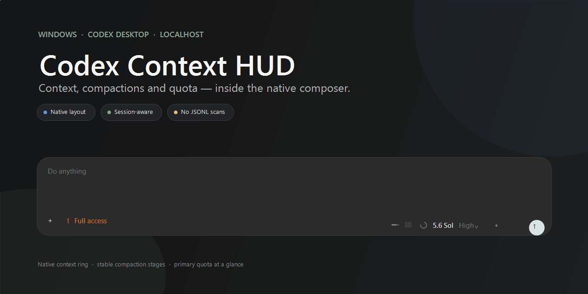

# Codex Context HUD

[English](README.en.md) · 简体中文

<p align="center">
  
</p>

<p align="center">
  <a href="https://github.com/wtf12345789/codex-context-hud/releases"></a>
  
  <a href="LICENSE"></a>
</p>

Codex Desktop 的紧凑上下文 HUD。它保留原生上下文圆环，在左侧加入账户剩余额度和当前会话压缩阶段；平时只显示图标，悬停才显示准确数字。

压缩 1–3 次为原生灰、4–6 次柔黄、7–9 次柔红、10 次以上全黑。切换会话后会等待统计加载完成再播放一次动效，没有额外悬浮窗，也不再扫描或缓存大型会话 JSONL。

## 安装

仅支持 Windows 10/11 的 Microsoft Store 版 Codex Desktop。下载并解压 [最新 Release](https://github.com/wtf12345789/codex-context-hud/releases/latest)，运行：

```powershell
powershell -ExecutionPolicy Bypass -File .\Install.ps1
```

如果 Codex 已经打开，请自行保存工作并退出，然后从开始菜单启动 **Codex with Context HUD**。安装器和启动器不会强制关闭或重启 Codex。

卸载：

```powershell
powershell -ExecutionPolicy Bypass -File .\Uninstall.ps1
```

## 安全与源码

HUD 通过只绑定 `127.0.0.1` 的本地调试端口挂载，不修改 Codex 安装文件，不上传对话、日志或凭据。核心实现见 [`RendererHudBridge.cs`](RendererHudBridge.cs) 和 [`RendererHudScript.js`](RendererHudScript.js)。

从源码构建运行 `.\Build.ps1`，生成便携包运行 `.\Package.ps1`。项目采用 [MIT License](LICENSE)。
